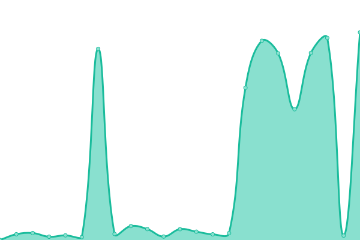

# [📈 Live Status](https://igordrangel.github.io/solicita.ai-status): <!--live status--> **🟧 Partial outage**

This repository contains the open-source uptime monitor and status page for [Igor D. Rangel](https://igordrangel.com.br), powered by [Upptime](https://github.com/upptime/upptime).

With [Upptime](https://upptime.js.org), you can get your own unlimited and free uptime monitor and status page, powered entirely by a GitHub repository. We use [Issues](https://github.com/igordrangel/solicita.ai-status/issues) as incident reports, [Actions](https://github.com/igordrangel/solicita.ai-status/actions) as uptime monitors, and [Pages](https://igordrangel.github.io/solicita.ai-status) for the status page.

<!--start: status pages-->
<!-- This summary is generated by Upptime (https://github.com/upptime/upptime) -->
<!-- Do not edit this manually, your changes will be overwritten -->
<!-- prettier-ignore -->
| URL | Status | History | Response Time | Uptime |
| --- | ------ | ------- | ------------- | ------ |
|  [API](https://api.solicita-ai.com/health) | 🟩 Up | [api.yml](https://github.com/igordrangel/solicita.ai-status/commits/HEAD/history/api.yml) | 

 8207ms
     
 | 

<a href="https://status.solicita-ai.com/history/api">97.44%</a>
    

|  [Serviço de IA](https://igordrangel--solicita-ai-modal-api-fastapi-app.modal.run/health) | 🟩 Up | [servico-de-ia.yml](https://github.com/igordrangel/solicita.ai-status/commits/HEAD/history/servico-de-ia.yml) | 

 2810ms
     
 | 

<a href="https://status.solicita-ai.com/history/servico-de-ia">100.00%</a>
    

|  [Site](https://solicita-ai.com) | 🟥 Down | [site.yml](https://github.com/igordrangel/solicita.ai-status/commits/HEAD/history/site.yml) | 

 61ms
     
 | 

<a href="https://status.solicita-ai.com/history/site">0.00%</a>
    

|  [Dashboard](https://dashboard.solicita-ai.com) | 🟩 Up | [dashboard.yml](https://github.com/igordrangel/solicita.ai-status/commits/HEAD/history/dashboard.yml) | 

 221ms
     
 | 

<a href="https://status.solicita-ai.com/history/dashboard">100.00%</a>
    

<!--end: status pages-->

[**Visit our status website →**](https://igordrangel.github.io/solicita.ai-status)

## 📄 License

- Powered by: [Upptime](https://github.com/upptime/upptime)
- Code: [MIT](./LICENSE) © [Anand Chowdhary](https://anandchowdhary.com), supported by [Pabio](https://pabio.com)
- Data in the `./history` directory: [Open Database License](https://opendatacommons.org/licenses/odbl/1-0/)
